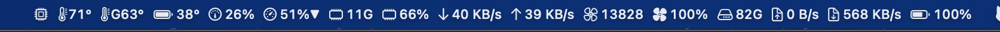
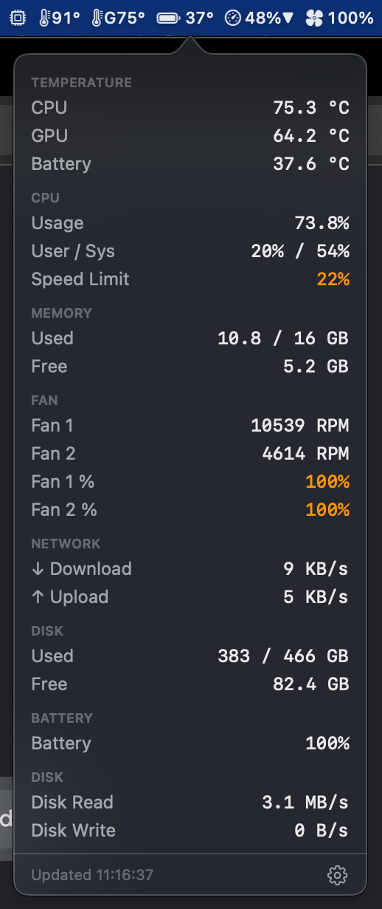
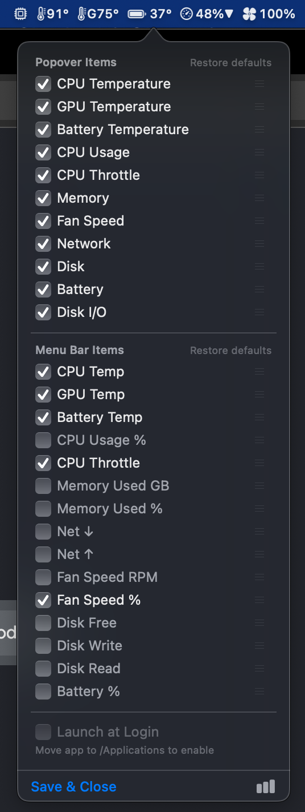

# MacStat

A minimal macOS menubar system monitor. No bloat, no subscriptions — just the numbers you care about.



## Features

- **Temperature** — CPU, GPU, battery
- **CPU** — usage %, throttle / speed limit
- **Memory** — used GB or %
- **Fan** — RPM or %
- **Network** — download / upload throughput
- **Disk** — free space, read / write speed
- **Battery** — charge %

All items are individually toggleable and reorderable from the Settings panel.

## Screenshots

| Popover | Settings |
|---|---|
|  |  |

## Installation

1. Download `MacStat.dmg` from [Releases](https://github.com/azlarsin/mac-stat/releases)
2. Open the DMG and drag **MacStat.app** to `/Applications`
3. Launch MacStat — it lives in your menubar

> **Note:** Installing to `/Applications` is required for Launch at Login to work.

## Requirements

- macOS 13 Ventura or later
- Intel or Apple Silicon (universal binary)

## Build from Source

```bash
xcodebuild \
  -project MacStat/MacStat.xcodeproj \
  -scheme MacStat \
  -configuration Debug \
  build \
  CODE_SIGN_IDENTITY="" \
  CODE_SIGNING_REQUIRED=NO \
  CODE_SIGNING_ALLOWED=NO
```

To build a signed, notarized DMG for distribution:

```bash
./release.sh
```

Requires a valid Developer ID Application certificate and a stored `notarytool` keychain profile named `MacStatNotary`.

## Author

[azlar](https://github.com/azlarsin)
