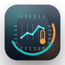

<p align="center">
  
</p>

<h1 align="center">MacStat</h1>

<p align="center">
  A no-frills macOS menubar monitor. Live stats, zero clutter.
</p>

<p align="center">
  
</p>

---

## What it shows

Pick exactly what appears in your menubar and popover — everything is toggleable and reorderable.

| | |
|---|---|
| **Temperature** | CPU · GPU · Battery |
| **CPU** | Usage % · Throttle / speed limit |
| **Memory** | Used GB or % |
| **Fan** | RPM or % |
| **Network** | Download · Upload |
| **Disk** | Free space · Read / write speed |
| **Battery** | Charge % |

## Screenshots

<p align="center">
  
  &nbsp;&nbsp;
  
</p>

## Install

1. Download `MacStat.dmg` from [Releases](https://github.com/azlarsin/mac-stat/releases)
2. Open the DMG and drag **MacStat** to `/Applications`
3. Launch — it lives quietly in your menubar

> Installing to `/Applications` is required for **Launch at Login**.

**Requirements:** macOS 13 Ventura or later · Intel & Apple Silicon

## Build from source

```bash
xcodebuild \
  -project MacStat/MacStat.xcodeproj \
  -scheme MacStat \
  -configuration Debug \
  build \
  CODE_SIGN_IDENTITY="" \
  CODE_SIGNING_REQUIRED=NO \
  CODE_SIGNING_ALLOWED=NO
```

Signed + notarized DMG:

```bash
./release.sh
```

## Author

[azlar](https://github.com/azlarsin)
